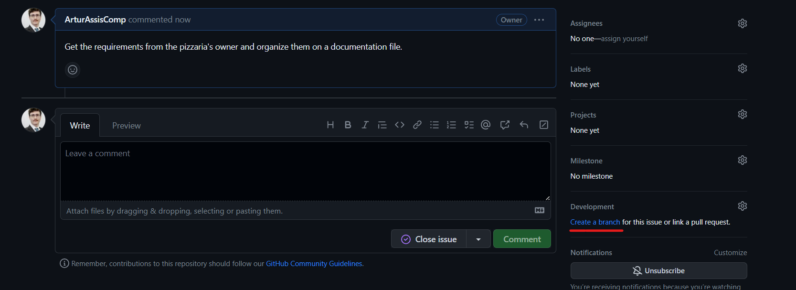

[![Issues][issues-shield]][issues-url]
[![MIT License][license-shield]][license-url]

<!-- PROJECT LOGO -->

<a id="readme-top"></a>

<br />
<div align="center">
  <a href="https://github.com/ArturAssisComp/pizzaiolo.git">
    
  </a>

  <h3 align="center">Pizzaiolo</h3>

  <p align="center">
    A simple and easy to use pizza ordering system.
    <br />
    <a href="#documentation"><strong>Explore the docs »</strong></a>
    <br />
    <br />
    <a href="https://github.com/ArturAssisComp/pizzaiolo/issues">Report Bug</a>
    <br/>
    <a href="https://github.com/ArturAssisComp/pizzaiolo/issues">Request Feature</a>
  </p>
</div>

<!-- TABLE OF CONTENTS -->
<details>
  <summary>Table of Contents</summary>
  <ol>
    <li><a href="#description">Description</a></li>
    <li><a href="#how-is-a-contribution-made">How to contribute</a></li>
    <li><a href="#requirements">Requirements</a></li>
    <li>
      <a href="#how-to-use-pizzaiolo">Using my-portfolio</a>
      <ul>
        <li><a href="#example-of-usage">Example</a></li>
      </ul>
    </li>
    <li>
      <a href="#documentation">Documentation</a>
      <ul>
	<details>
          <summary>index</summary>
          <li><a href="#overview">Overview</a></li>
          <li><a href="#menu-json-structure">JSON Structure</a>
            <ul>
            </ul>
          </li>
	</details>
      </ul>
    </li>
  </ol>
</details>


<p align="right">(<a href="#readme-top">back to top</a>)</p>


# Description 

Pizzaiolo is a simple and easy to use pizza ordering system. It is a template
that allows the user to customize the menu withouth worrying about the 
implementation of the ordering system. The user only needs to provide the menu
in JSON format and the template will do the rest. 

<p align="right">(<a href="#readme-top">back to top</a>)</p>

# How is a contribution made?

1. Create a branch from an issue ();


2. Clone the repository: 
```bash
git clone  https://github.com/ArturAssisComp/pizzaiolo.git
```
3. Change to the desired branch: 
```bash
cd pizzaiolo
git checkout <branch-name>
```
4. For each meaningful change, make a commit;

-> Fist, add the files that were changed: 
```bash
git add <filename1> <filename2> ... <filenameN>
```
-> Commit the changes: 
```bash
git commit -m "Implemented function foo()"
```
5. Push the changes: 
```bash
git push origin <name-of-the-branch>
```
6. If more changes are necessary, go to 4. Else,
   go to 7;
7. Create a pull request and assign someone to review the changes
   that were made in the branch;

=> Other useful commands:

Check the history of commits
```bash
git log
```
Check the status of the repository
```bash
git status
```
Get changes from remote repository from branch master
```bash
git pull origin <master-branch-name>
```

<p align="right">(<a href="#readme-top">back to top</a>)</p>

# Requirements


In order to use this portfolio template project, you will need:

1. **Web Browser**: A modern web browser 
that is capable of displaying HTML, CSS, and JavaScript properly.

2. **JSON menu Data**: You will need to provide your menu data in JSON format. 
This data will be used to dynamically populate your menu page. Please adhere 
to the structure specified in the 'documentation' section.

3. **Server (Optional)**: Although not strictly required for local use, if you 
want to host your portfolio online, you'll need a server. This could be a 
traditional web server, a serverless platform, or a hosting service like GitHub 
Pages. This readme will teach you how to host your menu page on GitHub Pages and
locally using python.

4. **Basic knowledge of HTML/CSS/JavaScript (optional) **: This is not required 
for basic usage, but if you want to customize the template beyond changing the 
JSON data, some understanding of these technologies will be needed.


<p align="right">(<a href="#readme-top">back to top</a>)</p>

# How to use pizzaiolo 


<p align="right">(<a href="#readme-top">back to top</a>)</p>

## Example of usage


<p align="right">(<a href="#readme-top">back to top</a>)</p>


# Documentation

## Overview


<p align="right">(<a href="#readme-top">back to top</a>)</p>

## Menu JSON Structure


<p align="right">(<a href="#readme-top">back to top</a>)</p>


<!-- MARKDOWN LINKS & IMAGES -->

[issues-shield]: https://img.shields.io/github/issues/ArturAssisComp/pizzaiolo?logo=github&style=for-the-badge
[issues-url]: https://github.com/ArturAssisComp/pizzaiolo/issues

[license-shield]: https://img.shields.io/github/license/othneildrew/Best-README-Template.svg?style=for-the-badge
[license-url]: https://github.com/ArturAssisComp/pizzaiolo/blob/master/LICENSE